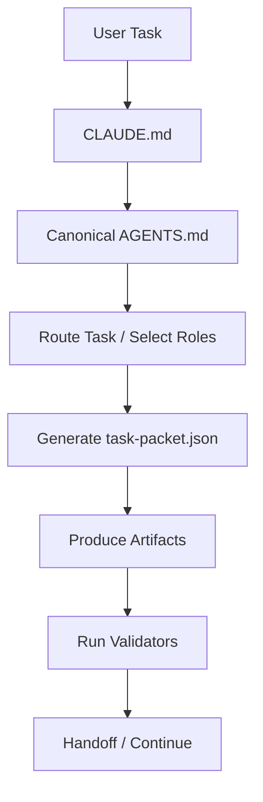

# AI Workflow Pack for Real Projects

> 把 `.claude` 和 `.agents` 扔进工程目录，让 `Claude Code`、`Codex`、`Cursor` 从“会聊天”升级成“会按流程交付”。


## TL;DR

这不是一个 prompt 收藏夹。

这是一套能直接放进真实工程目录、并驱动 `Claude Code` / `Codex` / `Cursor` 按统一流程工作的 AI workflow pack：

- 先读入口规则，而不是先自由发挥
- 先路由任务，而不是先读完所有角色
- 先生成 `task-packet.json`，而不是直接散文式输出
- 先形成 `方案.md` / `Todo.md` / `debug.json` / `describe_prompt.md`
- 最后跑校验，而不是“差不多就行”

如果你想要的不是“一个会聊天的 AI”，而是“一个能在工程目录里稳定推进任务的 AI 工作流底座”，这套仓库就是现成答案。

## Why People Star This Kind of Repo

因为多数 AI 工程协作最后都会翻车在同一组问题上：

- AI 很聪明，但每次都不一样
- 新会话一开，又要重新讲项目规范
- 角色很多，但没有交接契约
- 产出很多，但没有校验闭环
- 模型切换很酷，但复杂度很快失控

这个仓库的价值，不在于“让 AI 说得更像专家”。
而在于它把 AI 使用方式从：

**问答**

变成：

**项目内工作流**

## Before / After

### Before

- “帮我分析这个问题”
- AI 开始即兴发挥
- 回答看起来很聪明
- 但没有中间契约、没有统一产物、没有自检
- 下一个会话几乎要重来

### After

- 先读 `CLAUDE.md`
- 再读 `.claude/.../AGENTS.md`
- 先路由任务
- 先生成 `task-packet.json`
- 再生成 `方案.md` / `Todo.md` / `debug.json` / `describe_prompt.md`
- 最后跑 validators

最重要的变化只有一句：

> 把“问 AI”升级成“驱动一个可重复、可交接、可验证的工程流程”。

## What This Repo Actually Contains

```text
.
├── .claude
├── .agents
├── skill-iterations-test
├── CLAUDE.md
├── 使用说明.md
├── 使用示例.md
└── 优化报告.md
```

### `.claude`

真正的执行真源：

- canonical workflow
- references
- rules
- scripts
- templates

### `.agents`

轻量 wrapper 层：

- skill 触发入口
- UI metadata
- 默认 prompt

### `skill-iterations-test`

回归与状态层：

- fixtures
- validators
- current state index
- iteration reports

## The Two Core Skills

### `embedded-feature-planner`

用于：

- 新功能规划
- 工程接入
- bug 修复
- 编译失败 / 链接失败
- 运行异常排查
- 输出 `方案.md` / `Todo.md` / `debug.json`

### `expert-prompt-generator`

用于：

- prompt 生成
- 角色设计
- 提示词优化
- 维护 `describe_prompt.md`
- 把模糊需求压成高质量、可复用指令

## What Makes It Feel Different

很多仓库教你怎么“写更长的 prompt”。

这个仓库做的是另一件更难、也更实用的事：

### 1. Canonical First

真正入口不是对话，而是：

- `CLAUDE.md`
- `.claude/embedded-feature-planner/AGENTS.md`
- `.claude/expert-prompt-generator/AGENTS.md`

### 2. Route First

不是一上来就把所有角色塞进上下文，而是：

1. 判断任务模式
2. 判断任务场景
3. 选择最少必要角色
4. 执行对应 playbook

### 3. Artifact First

输出不是聊天记录，而是工程产物：

- `task-packet.json`
- `方案.md`
- `Todo.md`
- `debug.json`
- `describe_prompt.md`
- `role-summary.md`

### 4. Validation First

不是“写完就算”，而是“写完还要过检查”。

### 5. Model Routing That Stays in Its Lane

不是炫技式多模型，而是：

- 默认关闭
- 显式启用
- 结构化记录
- 错误配置不会偷偷生效

这点非常适合真实项目。

## 5-Minute Setup

把下面这些内容直接放进你的真实工程根目录：

```text
your-project/
├── .claude/
├── .agents/
├── CLAUDE.md
├── src/ or your real code
└── ...
```

如果你还想带上完整导航和验证样例，再加：

```text
优化报告.md
skill-iterations-test/
```

然后就可以在项目根目录直接开工。

## The Real Entry Order

进入工程目录后，优先级如下：

1. `CLAUDE.md`
2. `.claude/embedded-feature-planner/AGENTS.md`
3. `.claude/expert-prompt-generator/AGENTS.md`
4. `.claude/.../references/*`
5. `.claude/.../scripts/*`
6. `.agents/skills/*/SKILL.md`

一句话：

**`.claude` 是执行真源，`.agents` 是轻量触发器。**

## Copy-Paste Starters

### Claude Code

```text
请先遵循项目根目录的 CLAUDE.md。
然后阅读 .claude/embedded-feature-planner/AGENTS.md。
按 embedded-feature-planner 工作流处理当前工程任务。
默认关闭模型路由，除非我明确要求启用。
如果是复杂嵌入式任务，先生成 task-packet.json，再继续输出正式产物。
```

### Codex

```text
Use $embedded-feature-planner for this project task.
First follow the repository CLAUDE.md and then read .claude/embedded-feature-planner/AGENTS.md.
Keep model routing disabled unless I explicitly enable it.
Generate task-packet.json first, then continue with the project artifacts.
```

### Cursor

```text
先遵循项目根目录 CLAUDE.md。
再阅读 .claude/embedded-feature-planner/AGENTS.md。
按该工作流处理当前工程任务。
默认关闭模型路由。
先生成 task-packet.json，再执行后续步骤。
```

Prompt 任务时，把入口替换成：

- `.claude/expert-prompt-generator/AGENTS.md`
- 输出追加到 `describe_prompt.md`

## Workflow at a Glance



## Practical Highlights

### Task Routing

任务先被归类成：

- `planning`
- `implementation`
- `debug`

再进一步路由到具体场景：

- 新功能规划
- 编译失败 / 链接失败
- DTS / 驱动不生效
- 运行时异常 / 服务不稳定
- 发布阻塞 / 交付前收口

### Minimal Role Loading

不会默认加载全部角色。

它会先选最少必要角色，再在必要时扩角色。

### Task Packet as Contract

`task-packet.json` 会明确：

- mode
- scenario
- playbook section
- roles
- evidence targets
- acceptance checks
- handoff fields

这使得多角色协作、调试闭环和文档交接第一次变得“像工程流程”，而不是“像聊天历史”。

### Recent State Snapshot

仓库自带状态索引，会汇总：

- 当前能力快照
- validators 状态
- 最近一次产物摘要
- workspace 根目录是否已有真实产物

所以它不仅能跑，还能告诉你“现在跑到哪了”。

## Built-In Validation

仓库已经内置这些守门脚本：

- `validate_skill_wrappers.py`
- `validate_task_packet.py`
- `validate_model_routing_config.py`
- `validate_planning_artifacts.py`
- `validate_prompt_output.py`
- `validate_role_docs.py`
- `validate_rule_docs.py`
- `validate_reference_links.py`
- `validate_playbooks.py`

还有：

- wrapper 漂移检查
- fixture 回归
- current state index

这意味着它不仅会“生成”，还会“自证”。

## Useful Commands

### 看任务应该怎么走

```bash
python .claude/embedded_ai_roles/scripts/route_task.py --task "<任务描述>" --json
```

### 看最少必要角色

```bash
python .claude/embedded_ai_roles/scripts/select_roles.py --task "<任务描述>"
```

### 生成开工任务包

```bash
python .claude/embedded_ai_roles/scripts/generate_task_packet.py --task "<任务描述>" --output task-packet.json
```

### 校验任务包

```bash
python .claude/embedded_ai_roles/scripts/validate_task_packet.py --packet task-packet.json
```

### 校验模型路由配置

```bash
python .claude/embedded_ai_roles/scripts/validate_model_routing_config.py --config ".claude/embedded_ai_roles/assets/model-routing-template.json"
```

### 检查当前状态快照

```bash
python .claude/embedded_ai_roles/scripts/generate_current_state_index.py --check skill-iterations-test/current-state-index.md
```

## Who This Is For

适合：

- 想把 AI 直接嵌进真实工程目录的人
- 想让多种工具走同一套规范的人
- 需要中间契约、文档交接和校验闭环的人
- 嵌入式规划 / 修复 / 调试任务比较多的人
- 不想让模型路由默认乱飞的人

不太适合：

- 只想要几个随手复制的 prompt
- 不需要任何结构化产物
- 不在乎 AI 每次都换一种做法
- 不准备接受 workflow / validator 约束的人

## Current State

### Stable

- canonical workflows
- references 按需加载
- 最少必要角色路由
- task packet 生成与校验
- prompt 四行契约
- 默认关闭的模型路由
- wrapper 漂移校验
- 最近一次产物摘要索引

### Still Placeholder

- 模型路由模板中的真实 `model_id`
- 真实 Git 工程中的完整演练
- 多次真实任务的连续历史索引

## Read This Next

如果你想快速掌握全貌，按这个顺序读：

1. [使用说明.md](/E:/AI/skill%20V3/%E4%BD%BF%E7%94%A8%E8%AF%B4%E6%98%8E.md:1)
2. [使用示例.md](/E:/AI/skill%20V3/%E4%BD%BF%E7%94%A8%E7%A4%BA%E4%BE%8B.md:1)
3. [优化报告.md](/E:/AI/skill%20V3/%E4%BC%98%E5%8C%96%E6%8A%A5%E5%91%8A.md:1)
4. [CLAUDE.md](/E:/AI/skill%20V3/CLAUDE.md:1)
5. [current-state-index.md](/E:/AI/skill%20V3/skill-iterations-test/current-state-index.md:1)

## Final Take

如果你想要的不是“一个会聊天的 AI”，而是“一个进了工程目录就知道先读什么、先产什么、怎么校验、怎么交接的 AI 工作流底座”，这套仓库就是现成答案。
